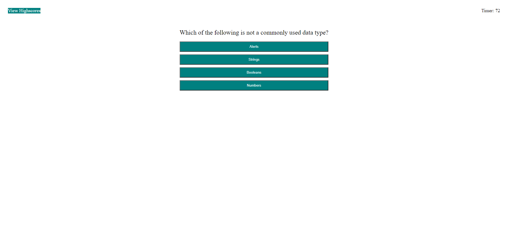

# logicquizgame

The quizgame application is created using 

* Manipulation of HTML DOM elements in javascript
* Localstorage functions to hold scores
* Onclick events to allow for functions to occur via action (click button)
* Timer usage by use of setInterval function

## Example snapshots and Usage

The program begins with a simple onclick function on the start button which will begin the timer at the top right and 
start the actual quiz application

The program will then open up the quiz question sections and will respond back. 

If you answered the question correctly it should show this  ...

... and if incorrect should subtract 15 seconds and show this ...

Once all the questions are answered they should bring you to the end page which will allow you to 
submit your scores and initials.

If you look closely the top left of the initial screen can also bring you to the Highscore page once more and let 
you go back to the quiz application with the Go Back button.

## Links to the project
You can find this linked at https://aznjp.github.io/logicquizgame/